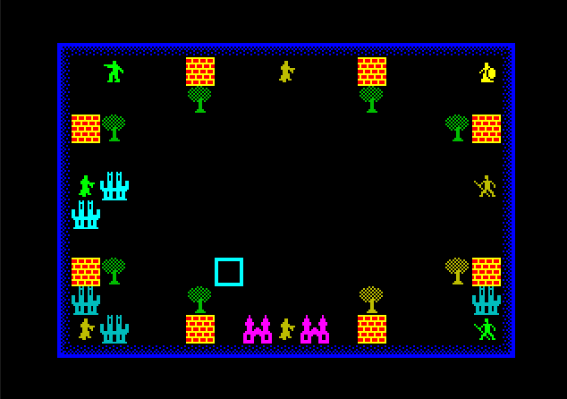
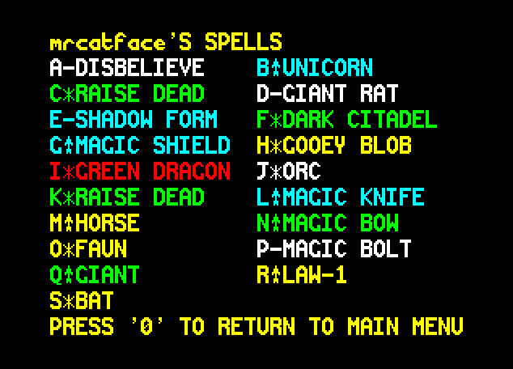

# Chaos Community Editon

Hi! This is a collection of hacks and pokes to the original Spectrum game Chaos: The Battle of Wizards

[try it here](https://spontificae.github.io/ChaosCE/ChaosCE.html)

## Implementedish
* Randomised spells for any combination of 1-8 human or computer players
* 5-6 extra spells per player
* Expanded number of trees to 12, walls to 10, castles to 2
* Arena modes (8 player only) - add magic trees or walls to your starting game

To use, simply load up ChaosCE.html, select your options and the download button will generate a .pok file that can be loaded or just dragged into a Spectrum emulator. It's terribly messy, and needs to be rewritten from scratch, but was initially just hacked together quickly before matches, and definitely looks it!

## Future ideas
* expanded map
* selectable options
* game config from web
* add pokfile support to jsspeccy
* but the best ideas are gonna come from you

feedback invited

